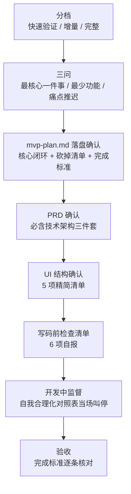

# MVP Guardian（MVP 守门员）

> **先把闭环跑通，再谈完美——第一版不追求一步到位。**

一个用于 vibe coding 的 AI Agent Skill：在你和 AI 结对开发时，**辅助并监督你遵循 MVP 思路**——适用于从零做新产品，也适用于给已有产品加拓展功能。

---

## 它解决什么问题

vibe coding 最大的风险不是「写不出来」，而是**写多了**：

- AI 会在你还没想清楚核心闭环时就开始写代码
- 写着写着冒出「顺便做个登录」「顺便上数据库」「顺便打磨下 UI」
- 报错后不回退，在错误代码上继续叠加修改，错上加错
- 第一版就追求一步到位，结果核心闭环永远跑不通

这个 skill 把「MVP 思路」从一句口号变成**可执行的流程约束**：在关键节点设门禁，没过不许往下走，并对偏离信号当场叫停。

## 核心机制：先分档，再走阶段门禁链

**第一步是分档**：做第一个提问之前，守门员先判断这次该走哪一档，并**说出判断**让你有机会推翻——档位选错，要么白走流程，要么失控。

| 档位 | 适用 | 流程重量 |
|------|------|---------|
| **快速验证档** | 「能不能做 X」的可行性问题：模型/接口/库到底行不行、够不够用 | 最轻：不落盘、不出 PRD，产出是**一个判断** |
| **增量档** | 已有产品上的小改动、小优化、单点需求 | 复用既有计划，只补本次变化 |
| **完整档** | 新产品、新功能模块、结构级改动 | 完整门禁链 |

三条铁律：**判据是项目而不是熟悉度**（「我懂这类应用」不成立，新项目一律走完整档）、**单向棘轮**（中途发现复杂度超预期只能升级档位，不能降级）、**拿不准选更重的档**。



**任何一道门禁未通过，禁止创建或修改生产代码。** 门禁未过时只允许修改文档稿（mvp-plan.md、PRD）和标注过的 UI 原型稿。

**阶段授权不传递**：一次点头只授权它被呈现的那一个阶段——批准计划 ≠ 批准 PRD ≠ 批准 UI ≠ 可以写码；「方向对」这类回应不算批准。这是把授权切碎，而不是加更多禁令。

| 阶段 | 门禁 | 关键动作 |
|------|------|---------|
| 一 · 想清楚 | 三问没过不写代码 | 先拆多子系统（若有）；再走三问：最核心的一件事（必须一句话）→ 最少功能清单 → 痛点推迟清单。复述时区分「你说的」与「我假设的」 |
| 二 · 划边界 | 用户确认范围 | 落盘 `mvp-plan.md`：核心闭环、最少功能、**砍掉清单**、扩展候选池、完成标准、技术约定 |
| 三 · PRD | **默认必经**，非可选 | 功能范围锁死在 mvp-plan 内；必含技术架构（数据流 / 选型理由 / 职责边界）；生成后先做四项自审（占位符 / 一致性 / 范围 / 歧义），再交给你审 |
| 四 · UI 结构 | 有界面的产品必经 | 只要求 5 项：页面清单、核心流程、四种状态、布局方向、按钮文案。**不做视觉打磨 ≠ 不做结构设计** |
| 五 · 开发 | 写码前 6 项自报 | 每次写代码前先输出核对结果；**自我合理化对照表**（9 条危险念头 → 现实）发现即叫停 |
| 六 · 验收 | 标准没过不算完成 | 对照完成标准逐条给「通过 + 证据」，含糊不得 |

**阶段状态机**记录在 `mvp-plan.md` 的「状态」字段，跨会话可追溯：

```
计划中 → PRD 审查中 → UI 审查中 → 开发中 → 已验收
                              ↘ 已暂停（任意阶段可进入）
```

**已有产品的小改动走增量档**：复用项目里已确认的核心闭环与技术约定，不重复提问，只补「本次变化 / 影响范围 / 完成标准」三项，状态机走 `变更计划中 → 开发中 → 已验收`。

**只想验证「能不能做」时走快速验证档**：不写计划、不出 PRD，用最便宜的方式试一次（一段提示词、一条 curl、十几行脚本），回报结论三选一——能做（附代价）/ 做不了（附原因）/ 能做但很贵（附替代方案）。试验代码标注「一次性，不进产品」。**验证通过 ≠ 可以开发**，要落地就重新走完整档或增量档。

**其他一直在生效的规则**：

- **报错处理以诊断为先**：停 → 保留现场（记录报错，不急撤销）→ 定位根因 → 最小修复一次 → 验证；**只有连改两次不中或改动开始扩散，才退回稳定检查点重来**
- **技术取舍按需判断**：判断标准是「满足核心闭环的最简单方案」，而不是一刀切禁止。登录 / 数据库 / 支付默认省略，但核心闭环离不开它们时（核心价值就是保存记录、多人协作……）第一版就该做，说明理由即可
- **需求变更同步 + 试用反馈**：开发中确认要加的功能必须同步进计划（含补完成标准）；验收通过后追加一条「谁试用了 / 解决了什么 / 反馈是什么 / 下一轮优先改什么」

## 下载与安装

### 方式一：下载现成安装包（推荐给不熟悉命令行的用户）

到 [**Releases 页面**](https://github.com/sunwang33/mvp-guardian/releases/latest)，按你用的工具下载对应压缩包（文件名带版本号，方便区分）：

| 安装包 | 适用工具 | 装到哪里 |
|--------|---------|---------|
| `mvp-guardian-v2.2.zip` | WorkBuddy | 解压出的 `mvp-guardian` 整个文件夹 → `~/.workbuddy/skills/` |
| `mvp-guardian-codex-share-v2.2.zip` | Codex | 里面的 `mvp-guardian/` 文件夹 → `~/.codex/skills/`；`prompts-mvp.md` 重命名为 `mvp.md` → `~/.codex/prompts/` |

> 历史版本的安装包留在各自版本的 Release 页里（可回退），但**建议始终用最新版**——`releases/latest` 页面上的就是当前推荐版本。Windows 上 `~` 就是 `C:\Users\你的用户名`。

### 方式二：网页下载源码（不需要命令行）

打开 [仓库首页](https://github.com/sunwang33/mvp-guardian) → 绿色 **Code** 按钮 → **Download ZIP**，解压后按下面的对应关系取文件。

### 方式三：git clone（开发者推荐）

直接克隆到技能目录，之后 `git pull` 就能更新，不用重复下载：

```bash
# macOS / Linux / Git Bash
git clone https://github.com/sunwang33/mvp-guardian.git ~/.workbuddy/skills/mvp-guardian
```

```powershell
# Windows PowerShell
git clone https://github.com/sunwang33/mvp-guardian.git "$env:USERPROFILE\.workbuddy\skills\mvp-guardian"
```

克隆到别处也可以，装的时候把对应文件夹拷进技能目录即可（见下表）。以后更新只需在该仓库目录执行 `git pull`。

> 本仓库根目录本身就是 WorkBuddy 技能目录结构（`SKILL.md` 在根），所以可以直接克隆到 `skills/` 下使用。

### 装哪几个文件？

仓库里同时放了两个平台的适配版，按你用的工具取：

| 你用的工具 | 需要的内容 | 目标位置 |
|-----------|-----------|---------|
| **WorkBuddy** | 仓库根目录的 `SKILL.md` + `references/` | `~/.workbuddy/skills/mvp-guardian/` |
| **Codex** | `codex/SKILL.md` + `references/` + `codex/agents/`；以及 `codex/prompts/mvp.md` | `~/.codex/skills/mvp-guardian/` 和 `~/.codex/prompts/mvp.md` |

小提示：WorkBuddy 只要文件夹里有 `SKILL.md` 就能识别，把仓库根目录整个文件夹拷进 `~/.workbuddy/skills/` 也可以，多出来的 README、`codex/` 等不影响运行。

Codex 的详细步骤（含 Windows PowerShell 写法）见 [`codex/安装说明.md`](codex/安装说明.md)。

### 一键部署（本仓库贡献者用）

```bash
bash scripts/deploy.sh          # 从本仓库部署到本机 WorkBuddy + Codex
bash scripts/deploy.sh --dry    # 只看会做什么，不实际写入
```

## 使用

**触发方式**（双通道）：

1. **自动**：对话中出现开发意图（「我要做一个 XX 网站」「给 XX 加一个功能」「能不能做 X」），守门员会先问一句是否启用，确认后进入流程
2. **手动**：说「mvp」「启动mvp」「mvp检查」「新功能」「开始开发」；Codex 里可直接敲 `/mvp`

**需求模糊时**：三问答不清核心那一件事，自动进入 grill 式追问模式——一次只问一个问题、每轮复述确认（并区分「你说的」与「我假设的」）、5 轮上限，收敛出一句话核心闭环后回到三问。

**产出物**：项目根目录的 `mvp-plan.md`。它是你和 AI 之间的合同，监督和验收都对照它。（快速验证档不落盘。）

## 项目结构

```
.
├── SKILL.md                     # 技能本体（WorkBuddy 版，根目录直接可装）
├── references/
│   └── mvp-principles.md        # 实践原则详版（附出处与修订记录）
├── codex/                       # Codex 适配（SKILL.md 与 AGENTS.md 由主本自动生成）
│   ├── SKILL.md                 # frontmatter 按 Codex 规范
│   ├── prompts/mvp.md           # /mvp 命令
│   ├── AGENTS.md                # 项目级强制注入（可选）
│   ├── agents/openai.yaml       # 界面显示元数据
│   └── 安装说明.md
└── scripts/
    ├── deploy.sh                # 一键部署到本机
    └── build_codex.py           # 由根目录 SKILL.md 重新生成 codex/ 两份文件
```

> 改了根目录 `SKILL.md` 后，先跑 `python scripts/build_codex.py` 重新派生 Codex 两份文件，再 `deploy.sh` 部署——保证两个平台的规则永远同一个来源。

## 设计哲学与诚实边界

**为什么先分档**：不同重量的活该配不同重量的流程——给「验证一个想法」套完整门禁会让人不愿用，给「新产品」省掉门禁会失控。分档判断必须**说出来**，因为它可能判错，你要能推翻；判据也必须是项目本身（有没有可读的既有流程），而不是 AI 的熟悉度。

**为什么是「门禁」而不是「提醒」**：软提醒在真实会话里会被忽略——实测中 AI 会绕过模糊表述直接写代码。所以本 skill 的选择是：门禁条款写具体、写码前强制自报核对结果、把 AI 的自我合理化念头逐条列出并对照现实。它的作用不是物理阻止抢跑，而是**让抢跑可见**。

**诚实边界**：本 skill 是提示词级约束，不存在运行时强制。**最后一道门禁永远是使用者自己的确认动作**——任何「AI 说过了门禁」都不等于「你确认过了」。

**与其他技能协同**：UI 结构阶段若环境中有 `design-taste-frontend` 或 `frontend-design` 等设计类技能，会自动调用以避免页面模板化；没有也不影响，内置 5 项清单兜底。本 skill 自包含，不依赖任何其他技能。

## 版本历史

见 [CHANGELOG.md](CHANGELOG.md)。当前 **v2.2**。

v2.0 的修订来自一次真实实测评估：初版在 Codex 实测中被判定为「6/10，是 MVP 提醒器而非守门员」——代理在 PRD 未确认时直接开始写页面。据此补齐了阶段门禁链、状态机、UI 门禁、写码前检查清单和报错安全回退。

v2.1 的修订来自使用反馈：三处规则过刚需要放宽（报错处理以诊断为先、技术取舍按需判断、已有项目小任务走增量简化流程），并补上两个流程缺口（需求变更同步更新计划、验收后记录试用反馈）。

v2.2 的修订来自「定调偏弱」的反馈：研究开源技能 `superpowers:brainstorming` 后吸收其路线分类、授权粒度、反自我合理化三处精华——新增**分档机制**（快速验证 / 增量 / 完整，单向棘轮）、**阶段授权不传递**、**自我合理化对照表**、多子系统先拆解、复述区分假设、PRD 四项自审。同时明确记录未采纳项（分节确认、浏览器可视化伴侣、Spec 文件体系等），保持自包含轻量。

## 贡献与反馈

欢迎提 issue 和 PR。特别欢迎这类反馈：

- **AI 没有遵守某条规则**——请附上具体现象（当时说了什么、AI 做了什么），用于加强对应措辞
- **门禁太严或太松**——比如某道门禁在你的场景里纯属浪费
- **新的偏离信号**——你踩过但清单里没写的坑

## 致谢

这个 skill 里的每条规则，都来自我在林粒粒学院 AI 编程实战营学习时踩过的坑、记下的笔记。

- 感谢林粒粒老师，课讲得通俗易懂，跟着练就能上手，笔记里才有了这么多一手素材
- 感谢小轩班班，平时盯进度、催作业，没有这份督促，这些笔记大概率在收藏夹里吃灰
- 感谢同学 Shzy，看他的作品和做法，给了我不少设计上的灵感

UI 部分参考了 [taste-skill](https://github.com/Leonxlnx/taste-skill) 的反模板化思路，少了一些 AI 味。

## License

[MIT](LICENSE) © 2026 sunwang33
